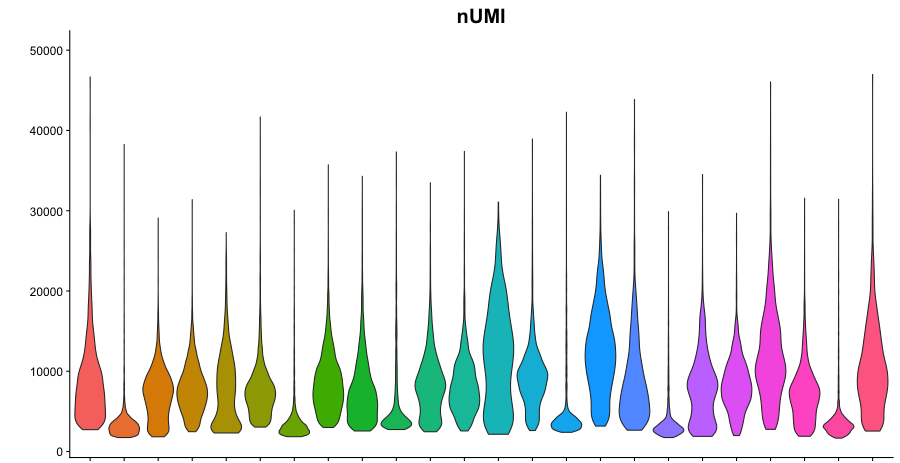

# Sequencing depth

*How many reads do we need to sequence per scRNA-seq library to achieve good recovery?*

Library preparation captures only a fraction of the RNA in the cell. The capture rate is 60-80% in SmartSeq2 (SS2) and approximately 14% in 10x (with v2 chemistry). Sequencing also recovers only a part of the cDNA library (i.e. the captured RNA). Our aim is to recover most, if not all, information in the prepared library during sequencing, so that we lose none of the resources spent on library preparation. A second aim is to find a good tradeoff between sequencing depth (i.e. recovery) and cost.

Please note that depending on project goals, it may be preferable to have another approach: increasing cell count or decreasing sequencing cost. See [Zhang et al. (2018)](https://www.biorxiv.org/content/10.1101/389296v2) for further discussion of the topic, and this website: https://satijalab.org/costpercell.


## Contents ##
1. [Background](#background)
2. [SmartSeq2](#smartseq2)
3. [10x](#10x)
	- [*Cell recovery ratio*](#cell-recovery-ratio)
	- [*Minimum read count*](#minimum-read-count)
	- [*Distribution of reads*](#distribution-of-reads)
	- [*Calculating required number of reads*](#calculating-required-number-of-reads)
4. [10xQC](#10xqc)
	- [*Cell recovery ratio*](#cell-recovery-ratio)
	- [*Minimum read count*](#minimum-read-count)


## Background

We must consider 3 main factors if we want to estimate the required number of reads:
1. Cell recovery ratio: number of cells loaded *vs* number of recovered cells.
2. Minimum read count: minimum number of reads per library, for desired level of library recovery.
3. Distribution of number of reads per library: the range (spread) helps in choosing a target mean read per library so that all (or most) libraries will be above the threshold for desired recovery.

In this context, a *library* is a collection of cDNA from the same *cell,* except where noted.

---


## SmartSeq2

1) Cell recovery ratio: in SS2 this is 1:1.

An example SmartSeq2 dataset:


2) Full library recovery begins at 800k read/library.

3) Distribution: spread of dataset is around 600k.

This is in agreement with [Svensson et al. (2017)](https://www.nature.com/articles/nmeth.4220):
*"Saturation occurs at 4.6 million reads per cell. The gain from 1 to 4 million reads per sample is marginal, whereas moving from 100,000 reads to 1 million reads corresponds to an order-of-magnitude gain in sensitivity."*

**Conclusion**: aim for minimum 1M read / cell *on average,* and an **optimum of 1.25M read / cell** to take the spread into account.

---


## 10x

The function [read10xsummary()](https://github.com/veghp/R_scripts/blob/master/read10xsummary.R) reads 10x cellranger metrics_summary.csv or web_summary.html files into a matrix.

### Cell recovery ratio

We use this function to find out the number of recovered cells in our example dataset.

```
sampledir <- "path/to/data/"
tenx.samples <- dir(sampledir, full.names = F)
web_summary.html.files <- file.path(sampledir, tenx.samples, "web_summary.html")

web_summaries <- read10xsummary(tenx.samples, web_summary.html.files, what = "html")

mean(web_summaries[, "Estimated.Number.of.Cells"])
range(web_summaries[, "Estimated.Number.of.Cells"])
pd <- web_summaries[, "Estimated.Number.of.Cells"]
boxplot(pd, ylim = c(0, max(pd)))
stripchart(pd, vertical = TRUE, add = TRUE, method = "jitter", col = "red", pch = 20)
```


From 7000 cells loaded for each channel, we recovered on average 3700 cells, which is close to the expected 4000. However, variability and range was relatively big (501&ndash;11014 cells).

Estimated.Number.of.Cells / Estimated.number.of.cells.loaded = 3700 / 7000 = 0.53

1. **Cell recovery ratio** is about 1:2 or 50%.


### Minimum read count

*What is the required number of reads for each library?*

Unfortunately, the 'number of reads/cell', or 'UMI/cell' data are not provided. Other measures are provided:

**Sequencing saturation**

Definition from the [10x website](https://kb.10xgenomics.com/hc/en-us/articles/115005062366-What-is-sequencing-saturation-?): *"Sequencing saturation is a measure of the fraction of library complexity that was sequenced in a given experiment. The inverse of the sequencing saturation can be interpreted as the number of additional reads it would take to detect a new transcript.*

*Sequencing saturation is dependent on the library complexity and sequencing depth."*

Note that in the definitions above, *library* means the collection of cell-libraries in one 10x channel. The formula for [calculating saturation](https://kb.10xgenomics.com/hc/en-us/articles/115003646912-How-is-sequencing-saturation-calculated-?) is:

```Saturation = 1 - (n_deduped_reads / n_reads)```

* n_deduped_reads: Number of unique (valid cell-barcode, valid UMI, gene) combinations among confidently mapped reads.

* n_reads: Total number of confidently mapped, valid cell-barcode, valid UMI reads.

From the above, one can calculate the ratio of unique reads and all reads for a sample (channel):

```
S = 1 - (n_deduped_reads / n_reads)

n_deduped_reads / n_reads = 1 - S
```

where S is saturation.

```Mean.Reads.per.Cell = Number.of.Reads / Estimated.Number.of.Cells```

This is the total number of sequenced reads divided by the number of barcodes associated with cell-containing partitions. The numerator is the total input reads that come from the fastq without any filtering. The denominator is the number of estimated cells. Therefore it also includes reads that weren't coming from our cells.

* Number.of.Reads: Total number of single-end reads that were assigned to this channel in demultiplexing.


We can plot the above variables for an indirect estimation of required number of sequencing reads, using [plotData()](https://github.com/veghp/R_scripts/blob/master/plotData.R):

```
x <- "Mean.Reads.per.Cell"
y <- "Sequencing.Saturation"
plotData(web_summaries, x, y, line = "spline")
```


2. The required *minimum* number of reads for each cell (library) is approximately 150k.


### Distribution of reads

What should be the average number of reads / library so that most cells are above the minimum requirement?

Ideally one should plot number of reads for each cell to get an estimate for dispersion. Unfortunately these statistics are not provided, and must be calculated from fastq files. Instead, we estimate from SS2 data range (as seen above), and from nUMI spread:



(Supporting this approach, Figure 1B in [Hughes et al. (2019)](https://www.biorxiv.org/content/10.1101/689273v1) shows a linear relationship between UMI/cell and Read/cell, with a slope of 1/5.)

3. We see that most libraries fall within ±50% of the mean, or ±75k reads.

Similarly, we see a ~1/5 ratio for (UMI/cell) / (Gene/cell):


### Calculating required number of reads

**C * R * (M + D)**

where C is the estimated number of cells *loaded* (7000 cell),

R is the cell recovery ratio (0.5),

M is the minimum number of reads/cell (150\*10^3 read/cell),

D is compensating for distribution (75\*10^3 read/cell).

However, aiming 50% above the required minimum may be too wasteful, depending on application. 

---


## 10xQC

We repeat the above analysis with data downloaded from the [10xQC](http://10xqc.com) website.

### Cell recovery ratio

```
data10xqc <- read.delim("10xqc.tsv")
data10xqc <- data10xqc[data10xqc$Species == "Homo sapiens", ] # use only human
data10xqc$recovery.ratio <- as.numeric(
  data10xqc$Estimated.Number.of.Cells / data10xqc$Estimated.number.of.cells.loaded)
mean(data10xqc$recovery.ratio)
# [1] 0.4944557
range(data10xqc$recovery.ratio)
# [1] 0.03576471 3.68600000

boxplot(data10xqc$recovery.ratio)
stripchart(data10xqc$recovery.ratio, vertical = TRUE, add = TRUE, 
  method = "jitter", col = "red", pch = 20)
```


While the variability was large, the average ratio was 0.494, which confirms our above results.

1. **Cell recovery ratio** is about 1:2 or 50%.


By method:

```
plot(data10xqc$Cell.counting.technology, data10xqc$recovery.ratio, las = 2)
points(recovery.ratio ~ jitter(as.numeric(Cell.counting.technology)),
  data10xqc, col = "red")
```


### Minimum read count

```
plotData(data10xqc, x, y, xlim = c(0, 600*10^3))
abline(a = 80, b = 0, col = "grey50")
abline(b = 1, v = 150*10^3, col = "grey50")
```


2. We conclude again that most samples with at least **150k** mean read/cell are above 80-90% saturation. (Note: a few outliers are not seen on plot.)

